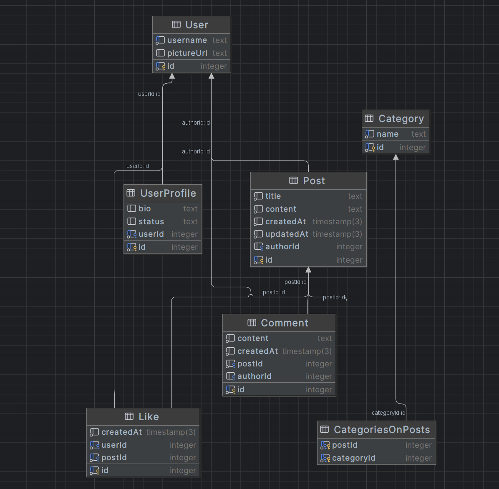

#### By: Петров Максим Олегович M3300

- - -

Тема: сайт для постинга статей и их комментирования (на фронтенде получилась просто солянка из
страниц для лаб, но factorio-article + some-post - примерно то, что должно быть)
 
[Ссылка](https://fish-from-sandiego.onrender.com/)

## Диаграмма

### User

Есть username (уникальный)
Ссылка на фото профиля

### UserProfile

one to one к юзеру,
могут быть bio и status (а могут быть и null)

### Post
many to many к юзеру  
Есть автор, комментарии, лайки  
Есть заголовок и основной контент
 
Также у поста может быть 0 или несколько категорий

### Category
Характеризуется уникальным именем

### Like

Может быть поставлен на пост юзером, так что связка юзер-пост для лайка уникальна

### Comment

Почти как с лайком, но один юзер может написать несколько комментариев под постом
